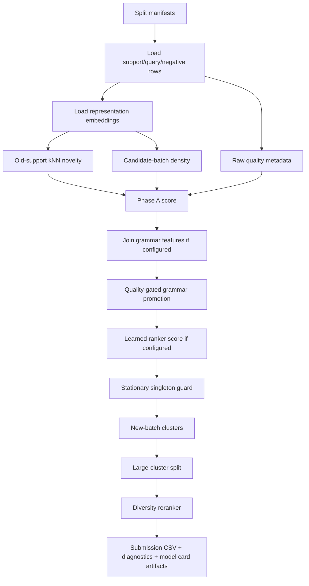
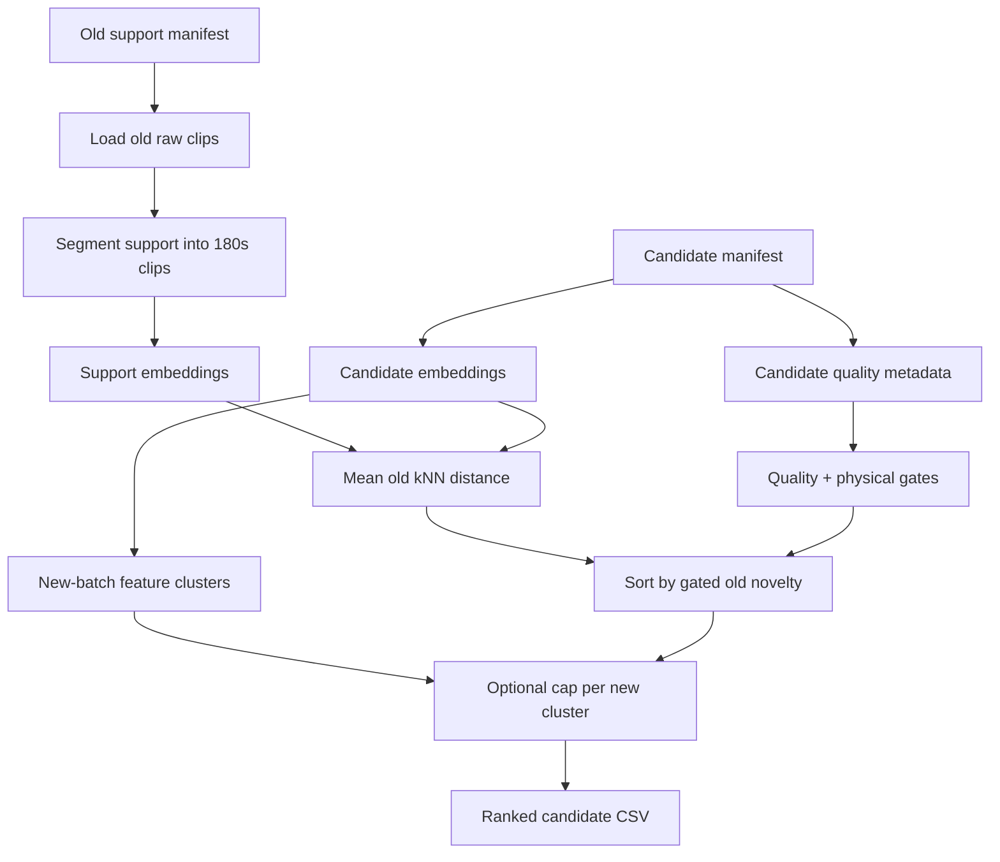
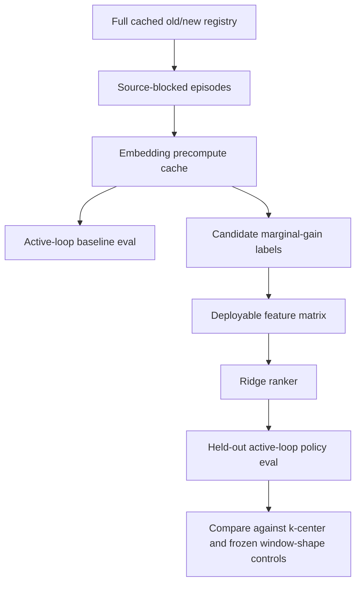

# Current Architecture Report

Date: 2026-04-29

Project: `active-learning-v2` / `marginal-data-value`

This report summarizes the current state of the project as it exists in the repository: what the architecture is, how the actual ranking model works, what has been built, what has not been built, and what has been tried so far.

## Executive Summary

The project is an IMU clip ranking system. Its goal is not anomaly detection and not generic novelty detection. The intended objective is:

```text
useful_value ~= quality * old_corpus_novelty * new_batch_support * diversity
```

The repository now contains two related but distinct systems:

1. A deployable deterministic selector/ranker.
   This is the practical, challenge-facing path. It ranks new IMU clips using old-corpus geometric novelty, quality gates, physical validity gates, and diversity caps. The current strongest deployable family is still simple and auditable: quality-gated geometric coverage, not a learned active-learning model.

2. A newer active-acquisition research pipeline.
   This simulates source-blocked acquisition episodes on the old corpus, computes hidden-target coverage gains, trains a supervised ranker, and compares that learned policy to strong geometric controls. This path is much closer to the real "active learning" idea, but its first learned rankers have not beaten the best simple baselines.

The most honest current statement is:

```text
The project has a strong audited geometric marginal-coverage ranker.
It has the machinery for learned active-acquisition training.
It does not yet have a learned policy that should replace the geometric controls.
```

## Repository Shape

Top-level structure:

| Path | Role |
| --- | --- |
| `marginal_value/data/` | Manifest handling, source/cache audits, GCS/archive caching, split safety. |
| `marginal_value/preprocessing/` | IMU parsing, feature extraction, robust normalization, quality scoring. |
| `marginal_value/indexing/` | Cosine search, kNN features, clustering support. |
| `marginal_value/ranking/` | Main deterministic ranking pipeline, score blending, grammar promotion, reranking, audit card generation. |
| `marginal_value/select.py` | Frozen external evaluator interface. |
| `marginal_value/active/` | Active-acquisition episode generation, label generation, policy evaluation, supervised ranker. |
| `marginal_value/models/` | Handcrafted encoder, tokenizer, n-gram grammar, SSL encoder, linear ranker pieces. |
| `marginal_value/tokenization/` | Tokenizer fitting, token transform, grammar feature generation. |
| `marginal_value/eval/` | Scientific evaluation protocols, ablations, blocked evals, audits. |
| `marginal_value/training/` | Modal-only SSL encoder training. |
| `modal_*.py` | Thin Modal entrypoints for remote jobs. |
| `configs/` | JSON/YAML configs for ranking, caching, training, active evaluation, and audits. |
| `docs/` | Project memory, scientific decisions, methods notes, plans, and result summaries. |
| `tests/` | 54 local tests covering pipeline pieces, selectors, configs, active modules, and eval logic. |

Local dependencies remain intentionally light:

```text
numpy
pandas
modal optional extra
```

PyTorch and CUDA-heavy work are intentionally kept inside Modal-only paths.

## Current System Layers

There are four user-visible execution modes, each with a different maturity level.

| Layer | Entrypoint | Current purpose | Status |
| --- | --- | --- | --- |
| Simple local CSV ranker | `marginal-value rank` | Original dependency-light demo over local CSV folders. | Works, but not the main current challenge path. |
| Frozen external selector | `marginal-value select` / `python3 -m marginal_value.select` | Challenge-safe selector using only old support and new candidate manifests. | Main clean external interface. |
| Modal baseline/challenge ranker | `modal_rank.py` with ranking configs | Richer audited ranking over cached Modal data with grammar, guards, diversity, and candidate eval. | Main experimental production-ranker family. |
| Active-acquisition pipeline | `modal_active_*.py` | Simulated acquisition episodes, marginal-gain labels, learned policy experiments. | Built and run; learned policy not yet promoted. |

## Current Deployable Model

The current deployable model is best understood as a quality-gated geometric coverage ranker.

### Frozen External Selector

Implemented in:

- `marginal_value/select.py`
- exposed through `marginal-value select`

Default external-selector behavior:

```text
old support traces
  -> optional segmentation into 180-second clips
  -> representation embedding
candidate clips
  -> same representation embedding
  -> quality metadata
  -> old-support kNN novelty
  -> new-batch clustering
  -> quality/physical validity gate
  -> old-novelty ranking with optional source/cluster cap
  -> ranked CSV
```

Default selector parameters:

| Parameter | Default |
| --- | ---: |
| representation | `window_shape_stats` |
| old support segment length | `180s` |
| old kNN | `k=5` |
| quality threshold | `0.85` |
| max stationary fraction | `0.90` |
| max absolute value | `60.0` |
| candidate cluster similarity | `0.985` |
| source/cluster cap | `2` |

Important constraint:

```text
The selector does not accept labels, targets, evaluation rows, hidden-target clips,
or oracle features. It only sees old support and the new candidate batch.
```

Output columns include:

```text
sample_id, rank, score, quality_score, old_novelty_score,
quality_gate_pass, physical_validity_pass,
physical_validity_failure_reasons, stationary_fraction, max_abs_value,
new_cluster_id, new_cluster_size, reranker, raw_path
```

### Rich Modal Ranking Path

Implemented mainly in:

- `marginal_value/ranking/modal_baseline_rank.py`
- `marginal_value/ranking/baseline_ranker.py`
- `modal_rank.py`

The current promoted challenge-style config is:

```text
configs/baseline_ranking_new_quality_gated_grammar_physical_source_hybrid75_feature_subcluster_rawcorr_stationary_guard_tiered_childcap2_5_subcluster40.json
```

That config currently uses:

| Component | Setting |
| --- | --- |
| support split | `pretrain` |
| query split | `new` |
| support manifest | `cache/manifests/pretrain_physical_source_urls.txt` |
| new manifest | `cache/manifests/new_urls.txt` |
| representation | `window_mean_std_pool` |
| old kNN | `k=10` |
| new density k | `k=10` |
| novelty weight | `0.75` |
| grammar score variant | `quality_gated_grammar` |
| grammar score weight | `0.3` |
| stationary singleton guard | enabled |
| large-cluster split | feature k-means, target subcluster size `40` |
| reranker | `tiered_cluster_cap` |
| cap schedule | top 50 max 2 per cluster, top 200 max 5 per cluster |
| quality metadata max samples | `5400` |
| corruption eval | raw-signal flatline/spike/saturation/jitter negatives |

The core Phase A score is:

```text
old_novelty_score = minmax(mean cosine distance to old-support kNN)
new_density_score = minmax(mean candidate-batch neighbor similarity)
ranker_score = 0.75 * old_novelty_score + 0.25 * new_density_score
final_score = quality_score * ranker_score
```

When grammar promotion is enabled:

```text
grammar_component = grammar_score * gate
ranker_score =
  (1 - grammar_weight) * phase_a_ranker_score
  + grammar_weight * grammar_component
final_score = quality_score * ranker_score
```

For the current config:

```text
grammar_weight = 0.3
gate = quality >= 0.45 and new-density gate passes
```

The stationary singleton guard then penalizes clips that look like high-novelty isolated stationary clips without enough new-batch or grammar support.

## Representations

The project currently has several representations.

| Representation | Where used | Meaning | Status |
| --- | --- | --- | --- |
| `window_mean_std_pool` | Modal ranking, active eval | Concatenate mean and std over cached window features. | Strongest practical Phase A ranking representation. |
| `window_shape_stats` | frozen external selector, active eval | Fixed window-shape statistics from IMU window features. | Current external selector default and frozen baseline. |
| `temporal_order` | active eval/ranker | Segment-level mean/std plus temporal differences. | Evaluation feature, useful for cross-representation checks. |
| `raw_shape_stats` | active eval/ranker | Raw IMU channel/diff/spectral/autocorr stats. | Useful as another validation view. |
| `HandcraftedIMUEncoder` | simple local CLI | Multiscale handcrafted summary padded/truncated to 512 dims. | Older local baseline. |
| `encoder_artifact` | Modal ranking option | Loads learned SSL embeddings from artifacts. | Wired but not promoted. |

The key architectural decision is that the strongest deployed path is not the SSL encoder. It is still the handcrafted geometric representation plus quality/diversity controls.

## Quality Model

Implemented in:

- `marginal_value/preprocessing/quality.py`
- `marginal_value/preprocessing/features.py`

Quality is a deterministic sensor-health score in `[0, 1]`. It is used as both:

1. a hard gate in selector-style ranking
2. a multiplicative factor in score-based ranking

Quality features include:

| Feature family | Examples |
| --- | --- |
| missingness | missing rate, NaN fraction, inf fraction |
| sensor artifacts | flatline fraction, saturation fraction, spike rate |
| physical plausibility | max absolute value, extreme value fraction |
| signal behavior | high-frequency energy, stationary fraction, axis imbalance |
| timestamp health | repeated timestamp fraction, timestamp jitter fraction |

The project has repeatedly leaned on quality gating because raw novelty can reward broken sensors. This is one of the strongest parts of the current system.

## Ranking Flow

### Modal Baseline Ranking Flow



### Frozen External Selector Flow



### Active-Acquisition Research Flow



## Data and Cache Reality

The data story changed substantially over the project.

Earlier state:

```text
pretrain manifest URLs: 200,000
manifest pretrain workers: 10,000
cached raw+feature support in early audit: 13,273
new split cached: 2,000
```

Then the project discovered the Modal `/source` mirror was incomplete:

```text
physical/extracted pretrain URLs found on Modal: 68,210
archive URLs found in pretrain_100k tar: 100,000
archive-only missing from extracted physical source: 39,191
physical + archive source union: 107,401
remaining absent from Modal mirror/archive path: 92,599
```

Later direct-GCS caching changed the active-acquisition substrate:

```text
old manifest URLs: 200,000
old cached URLs: 200,000
old registry clips: 200,000
old workers/source groups: 10,000
new manifest URLs: 2,000
new cached URLs: 2,000
new registry clips: 2,000
skipped uncached/raw/features: 0
```

Important nuance:

```text
Some current challenge/ranking configs still use physical-source support manifests
such as pretrain_physical_source_urls.txt. The active-acquisition scale configs
use pretrain_full_cached_urls.txt.
```

So the repo now has a full-cache active-learning substrate, while parts of the older challenge-ranking track remain configured around the physical-source support set.

## Active-Acquisition Pipeline

Implemented in:

- `marginal_value/active/registry.py`
- `marginal_value/active/episodes.py`
- `marginal_value/active/embedding_cache.py`
- `marginal_value/active/embedding_precompute.py`
- `marginal_value/active/evaluate_active_loop.py`
- `marginal_value/active/label_gain.py`
- `marginal_value/active/ranker.py`
- `marginal_value/active/baselines.py`

Current scale config:

```text
configs/active_episode_scale_pretrain.json
configs/active_embedding_precompute_scale_pretrain.json
configs/active_loop_eval_scale_pretrain.json
configs/active_label_gain_scale_pretrain.json
configs/active_ranker_train_scale_pretrain.json
```

Current episode structure:

| Item | Current scale setting |
| --- | ---: |
| episodes | `64` |
| support source groups per episode | `64` |
| heldout source groups per episode | `16` |
| support clips per group | `4` |
| known-like candidates per group | `1` |
| heldout-novel candidates per group | `4` |
| hidden targets per group | `2` |
| near-duplicate candidates | `32` |
| low-quality candidates | `16` |

Each episode contains:

```text
support_clip_ids
candidate_clip_ids
hidden_target_clip_ids
distractor_clip_ids
heldout_source_groups
known_source_groups
candidate_roles
```

Candidate roles are simulator diagnostics only. They are forbidden as learned model inputs.

### Marginal-Gain Label

Implemented in `marginal_value/active/label_gain.py`.

For a candidate `c`, the label is:

```text
gain(c) =
  coverage_error(hidden_targets | support_old)
  -
  coverage_error(hidden_targets | support_old union {c})
```

Labels are computed per representation and averaged into:

```text
balanced_gain
balanced_relative_gain
balanced_gain_after_greedy_prefix
balanced_relative_gain_after_greedy_prefix
```

The first supervised target is currently:

```text
balanced_gain
```

### Active Ranker

Implemented in `marginal_value/active/ranker.py`.

The current learned active ranker is a ridge regressor, not LightGBM LambdaRank.

Feature families include:

| Family | Examples |
| --- | --- |
| quality | quality score, quality penalty, stationary fraction, max-abs scaling |
| old novelty | per-representation old novelty and old novelty scores |
| candidate-batch geometry | nearest candidate distance, mean candidate distance |
| cluster/density | new cluster size/fraction, inverse cluster size, medoid distance |
| interactions | quality times novelty, quality times candidate distance |
| cross-representation summaries | novelty mean/std/min/max, candidate-distance mean/std |

Explicitly forbidden feature names include candidate role, hidden-target membership, coverage before/after, gain labels, oracle rank/selection, URL text, raw path text, and split labels.

The active ranker is evaluated as a policy:

```text
model scores -> ranked top K -> hidden-target coverage gain
```

It is not promoted based on RMSE or AUC.

## What Has Been Tried

### 1. Simple Handcrafted Local Baseline

Initial runnable slice:

- CSV loading
- handcrafted IMU encoder
- exact kNN over old embeddings
- new-batch density
- quality score
- diversity reranking
- submission and diagnostics writers

This still exists as `marginal-value rank`, but it is not the current main scientific path.

### 2. Quality-Gated Geometric Ranking

The durable baseline became:

```text
window_mean_std_pool + old-support novelty + new-batch support + quality gate
```

This remained strong because it is:

- simple
- auditable
- stable
- hard to overfit
- good at avoiding obvious sensor artifacts when quality gates are applied

### 3. Tokenizer and MotionBPE

Implemented:

- `PatchVQTokenizer`: numpy k-means stand-in for VQ
- `MotionBPE`: variable-duration primitive mining over adjacent token sequences
- token transform jobs
- grammar feature jobs

The theory tested:

```text
Fixed windows may shred real motion primitives.
MotionBPE can discover reusable variable-duration reach/pause/cycle/tool rhythm atoms.
```

Status:

```text
Useful for diagnostics and weak temporal-composition priors.
Not currently a dominant production model.
```

### 4. N-Gram Grammar Features

Implemented:

- `NGramMotionGrammar`
- grammar ablation eval
- motion-phrase holdout eval
- grammar score promotion

Features include:

```text
token_nll_mean
token_nll_p90
token_nll_p95
transition_nll_mean
transition_nll_p95
rare_bigram_fraction
rare_trigram_fraction
rare_phrase_fraction
longest_unseen_phrase_len
```

The useful variant became:

```text
quality_gated_grammar
```

Current interpretation:

```text
Grammar is a low-weight temporal-composition prior.
It is not a proven workflow model.
```

### 5. Diversity Reranking

Tried/implemented:

- MMR
- cluster bonus
- cluster cap
- round-robin cluster variants
- parent-cluster cap
- parent-prefix child-fill hybrid
- tiered cluster caps
- large-cluster feature k-means splitting

Important learning:

```text
Naive score sorting can collapse into duplicate-looking parent clusters.
Hard parent caps can exhaust too early and then fall back into the giant parent.
Tiered child caps plus subcluster splitting improved blocked validation,
but parent concentration remains a risk to watch.
```

### 6. Learned Linear Ranker on Ranking Diagnostics

Implemented:

- `marginal_value/models/learned_linear_ranker.py`
- `marginal_value/eval/learned_ranker_eval.py`
- integration into Modal baseline ranking

Observed result from project notes:

| Variant | nDCG@100 |
| --- | ---: |
| existing `final_score` | `0.5621` |
| learned linear | `0.5255` |

Decision:

```text
Do not promote learned linear ranker.
Keep the integration path, but require it to beat the current score before use.
```

### 7. SSL Encoder

Two versions were tried.

Original masked reconstruction encoder:

```text
checkpoint: ssl_encoder_pretrain_only.pt
effective rank: about 1.02
mean pairwise cosine distance: about 0.014
```

Interpretation:

```text
The embedding space was collapsed or nearly collapsed.
```

Anti-collapse encoder:

- normalized feature scaler fit only on pretrain
- `normalized_vicreg_mlp`
- masked reconstruction
- VICReg invariance/variance/covariance losses
- Gaussian noise, timestep dropout, channel dropout
- separate reconstruction and embedding heads

Status:

```text
Geometrically healthier than the original encoder.
Still not promoted because it has not improved ranking over the simple handcrafted representation.
```

### 8. Source-Blocked Validation

Implemented:

- `marginal_value/eval/source_blocked_eval.py`
- `modal_source_blocked_eval.py`

This was added because older candidate eval was too easy: it often compared `new` positives against sampled `pretrain` negatives while also using `pretrain` as support.

Source-blocked eval instead:

- uses old pretrain rows for positives and negatives
- holds out source groups and feature clusters
- removes candidates from support
- injects raw-signal corruption negatives
- reuses production scoring/reranking machinery

Full-run result from project notes:

| Config | Mean P@100 | Mean nDCG@100 |
| --- | ---: | ---: |
| safer `stationary_guard` | `0.250` | `0.215` |
| `tiered_childcap2_5_subcluster40` | `0.325` | `0.290` |

Decision at that time:

```text
Promote tiered_childcap2_5_subcluster40 as current submission candidate,
while keeping stationary_guard as safer fallback if visual review rejects parent concentration.
```

### 9. Marginal-Coverage / Challenge-Control Eval

Recent commits added challenge-control baselines to marginal coverage evaluation.

The current direction is to compare the frozen selector against:

- random valid
- quality only
- old novelty only
- k-center greedy quality-gated
- window-shape deterministic baseline
- challenge/control variants across multiple representations

This is the right scientific direction because it scores actual coverage improvement, not just candidate-vs-pretrain separability.

### 10. Active-Acquisition Full-Scale Run

Recent full active-acquisition results:

```text
episodes: 64
unique episode clips: 26,725
support clips per episode: 256
candidates per episode: 176
hidden target clips per episode: 32
candidate rows / labels: 11,264
positive balanced-gain labels: 5,154
positive rate: 45.8%
```

Baseline active-loop eval showed:

```text
oracle > deployable geometric policies > random/quality-only
```

At K=10, balanced relative gain:

| Policy | Gain |
| --- | ---: |
| oracle greedy | `0.2827` |
| k-center quality-gated | `0.1185` |
| window-shape cluster-cap | `0.1138` |
| old novelty only | `0.1007` |
| random valid | `0.0392` |
| quality only | `0.0344` |

Interpretation:

```text
The simulated episodes are not degenerate.
There is headroom above deployable policies.
Simple geometric policies are genuinely strong.
```

### 11. First Active Ridge Ranker

Trained on:

```text
64 episodes
11,264 candidate rows
48 features
target: balanced_gain
split: 48 train / 8 validation / 8 test episodes
```

Held-out test at K=10:

| Policy | Balanced relative gain |
| --- | ---: |
| oracle greedy | `0.3127` |
| learned ridge | `0.1705` |
| k-center quality-gated | `0.1753` |
| window-shape cluster-cap | `0.1615` |
| old novelty only | `0.1521` |

But hygiene at K=10 was poor:

| Policy | Artifact rate | Low-quality rate | Duplicate rate |
| --- | ---: | ---: | ---: |
| learned ridge | `0.138` | `0.138` | `0.637` |
| window-shape cluster-cap | `0.000` | `0.000` | `0.037` |
| k-center quality-gated | `0.000` | `0.000` | `0.037` |

Decision:

```text
Learned ridge found signal but is not promotable because it worsens artifact,
low-quality, and duplicate rates.
```

### 12. Learned Score Plus Quality-Gated K-Center Hybrid

Hybrid:

```text
learned score -> quality gate -> candidate pool -> k-center rerank
quality_threshold = 0.85
max_stationary_fraction = 0.90
max_abs_value = 60.0
pool_multiplier = 1.5
```

Result:

```text
Hygiene improved to zero artifact/low-quality at K=10.
Coverage gain remained below k-center and frozen window-shape controls.
```

Decision:

```text
Do not promote the hybrid yet.
The learned score is not yet useful enough as a pool filter.
```

## What You Have

You have:

- a runnable Python package with console script `marginal-value`
- a frozen external selector interface
- a rich Modal ranking pipeline
- robust quality and physical validity gates
- several IMU representations
- exact cosine kNN and CUDA-aware active-search helpers
- candidate-batch clustering and diversity rerankers
- grammar/tokenization machinery
- raw corruption negative eval
- source-blocked validation
- marginal-coverage evaluation
- full old/new registry coverage for the active-acquisition track
- simulated active-acquisition episodes
- marginal-gain labels
- supervised ridge ranker training/evaluation
- comprehensive test coverage for many module boundaries
- extensive docs recording decisions and failures

## What You Do Not Have Yet

You do not yet have:

- a learned active-acquisition policy that beats the strongest simple controls
- a promoted SSL encoder representation
- a transformer grammar LM
- a true GPU VQ tokenizer replacing the numpy k-means stand-in
- LightGBM LambdaRank or a stronger supervised ranking model
- final proof that pseudo metrics predict hidden challenge score
- a validated semantic workflow/factory transfer model
- a single unified "final" architecture; the repo currently contains both legacy selector/ranking paths and the newer active-acquisition rebuild
- a final daily-batch active-acquisition runner that consumes old/new manifests and emits the learned policy ranking

## Current Scientific Interpretation

The project has moved through three conceptual stages.

### Stage 1: Novelty Ranker

Original idea:

```text
Find clips far from old support, but suppress artifacts and duplicates.
```

This produced the stable quality-gated geometric selector.

### Stage 2: Temporal/Grammar Augmentation

Next idea:

```text
A valuable new workflow may be composed of familiar atoms in a rare temporal order.
```

This produced MotionBPE and n-gram grammar features. The result is useful as a weak prior but not decisive.

### Stage 3: Simulated Active Acquisition

Current newer idea:

```text
Use old-corpus source blocks to simulate acquisition episodes,
label candidates by actual hidden-target marginal gain,
then learn a deployable acquisition ranker.
```

This is the right architecture for a true active-learning claim. The infrastructure is in place, but the first learned policies do not yet beat the simple controls.

## Current Best Model Statement

There are two answers depending on what "current model" means.

### Current Best Deployable/Challenge Model

```text
quality-gated geometric coverage ranker
+ optional low-weight quality-gated grammar prior
+ stationary singleton guard
+ large-cluster feature splitting
+ tiered cluster-cap diversity reranking
```

It is not deeply learned. Its strength is that it is transparent, hard to leak hidden labels into, and heavily audited.

### Current Best Research Architecture

```text
full cached old corpus
  -> source-blocked active episodes
  -> multi-representation embedding cache
  -> hidden-target coverage-gain labels
  -> deployable feature table
  -> supervised ranker
  -> active-loop policy evaluation against k-center and frozen selector controls
```

This is the architecture to continue if you want the project to become a real learned active-acquisition system.

## Main Risks

| Risk | Why it matters | Current mitigation |
| --- | --- | --- |
| Artifact-as-novelty | Broken sensors can look highly novel. | Strong quality gates, physical validity gates, raw corruption eval. |
| Duplicate/parent-cluster collapse | Top ranks can overselect one workflow/source family. | Cluster caps, parent-prefix experiments, tiered caps, subcluster splitting. |
| Easy validation | `new` vs `pretrain` candidate eval can overstate readiness. | Source-blocked eval and marginal-coverage eval. |
| Learned ranker leakage | Simulated roles/targets can leak into model inputs. | Feature contract and forbidden-feature checks. |
| Learned model hygiene | Ridge ranker improved gain but selected artifacts/duplicates. | Quality-gated k-center hybrid tested, not promoted. |
| Representation overfitting | A policy can win in its own representation only. | Multi-view active eval over window, temporal, raw, and balanced metrics. |
| Architecture sprawl | Legacy ranking, challenge selector, and active-acquisition rebuild coexist. | Docs and configs clarify which path is deployable vs experimental. |

## Recommended Architecture Direction

If the goal is to rethink the architecture fundamentally, the cleanest future shape would be:

```text
1. Keep the frozen selector as the deterministic baseline and external-safe fallback.
2. Treat active-acquisition episodes as the main scientific training/eval substrate.
3. Promote only policies that beat both:
   - kcenter_greedy_quality_gated
   - window_shape_stats_q85_stat90_abs60_clustercap2
4. Keep hard quality/physical gates outside the learned model.
5. Use learned scores as one input to a coverage/diversity selector, not as a raw sort.
6. Unify final ranking around one daily-batch active runner once a learned/hybrid policy passes.
```

The next useful experiment is probably not more SSL or more grammar. It is:

```text
learned score + hard quality gate + coverage/diversity reranker
```

but with better model/features than the first ridge attempt, and with promotion judged only by held-out active-loop coverage gain plus hygiene metrics.

## Key Files to Read Next

For the current deployed selector:

- `marginal_value/select.py`
- `marginal_value/ranking/baseline_ranker.py`
- `marginal_value/ranking/modal_baseline_rank.py`
- `docs/methods_note.md`
- `docs/submission_contract.md`

For the active-acquisition rebuild:

- `docs/active_acquisition_rebuild_plan.md`
- `docs/active_acquisition_full_scale_results_2026-04-28.md`
- `docs/acquisition_ranker_feature_contract.md`
- `marginal_value/active/episodes.py`
- `marginal_value/active/evaluate_active_loop.py`
- `marginal_value/active/label_gain.py`
- `marginal_value/active/ranker.py`
- `marginal_value/active/baselines.py`

For scientific validation:

- `marginal_value/eval/source_blocked_eval.py`
- `marginal_value/eval/marginal_coverage_eval.py`
- `marginal_value/eval/physical_leave_cluster_eval.py`
- `marginal_value/eval/grammar_ablation_eval.py`
- `marginal_value/eval/motion_phrase_holdout_eval.py`

For model experiments:

- `marginal_value/models/ssl_encoder.py`
- `marginal_value/training/torch_train.py`
- `marginal_value/models/tokenizer.py`
- `marginal_value/models/grammar_lm.py`
- `marginal_value/models/learned_linear_ranker.py`

## Bottom Line

The project is no longer just a baseline novelty ranker. It has become a fairly serious audited marginal-coverage system with a second-generation active-acquisition evaluation harness.

But the current winning behavior is still simple:

```text
clean clip + far from old support + not an isolated artifact + not too redundant
```

The learned active-learning path is now structurally possible, but not yet empirically justified as the replacement.
